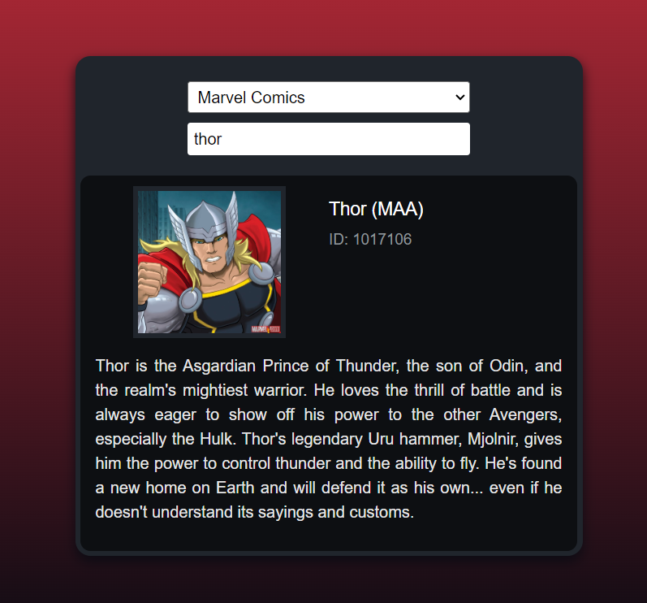
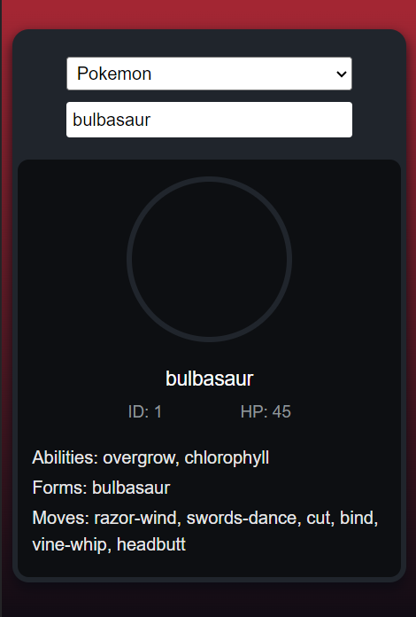

# CHARACTERS API
### Video Demo: 
### Project site: [shivp436.github.io](https://shivp436.github.io/)

#### Description:

#### Overview
The "Characters API" is a web application that allows users to fetch details about a character by providing their name and the universe to which they belong. The project currently supports three universes: Pokemon, Marvel, and Harry Potter. Users can request character information from any of these universes.

The application fetches character data from different official APIs associated with each universe and returns the requested information based on user-provided conditions.

#### Images
{width=500 height=800} {width=500 height=800} {width=500 height=800}

#### Usage
To use the "Characters API," follow these steps:

- Open the index.html file in your web browser.
- Enter the character's name and select the universe they belong to from the available options: Pokemon, Marvel, or Harry Potter.
- Click on the generated Character button.
- The application will send a request to the respective API associated with the selected universe and retrieve character information based on the provided name.
- The fetched character details will be displayed on the webpage.
- Auto filling of names is only available for Marvel Universe as of now.

#### Project Structure
The project is organized as follows:

- index.html: This HTML file contains the webpage structure and user interface elements.
- style.css: The main styling file that provides a visually appealing and responsive design for the webpage. Bootstrap styles are also utilized.
- script.js: This JavaScript file houses the algorithms and functionality responsible for making API requests, handling user inputs, and displaying character details.
- key.js: Stores API keys for accessing external APIs (e.g., Marvel API, Harry Potter API). Make sure to keep these keys secure in  a .env file when deploying the project.

#### Supported Universes
##### Pokemon
Fetches character image, name, HP, ID, Abilities, Forms, and moves.
#### Marvel
Retrieves character information such as name, image, official Marvel ID, and introduction.
##### Harry Potter
Gathers character details such as name, species, gender, titles, and wands.

HAve fun using the website.
